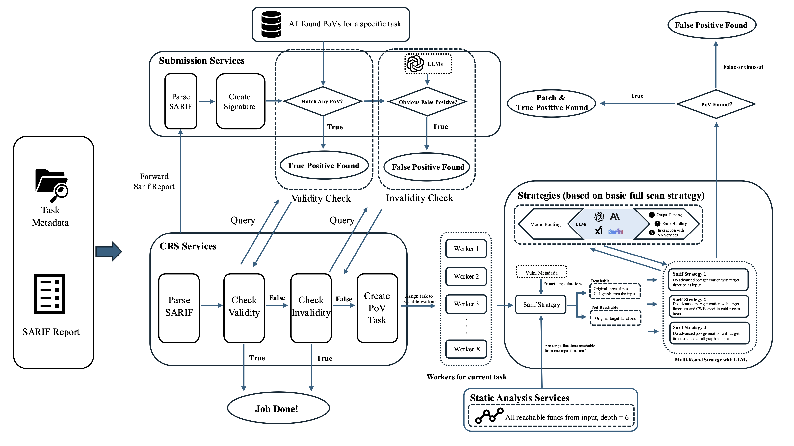

# SARIF PoV Strategy



*This diagram illustrates our SARIF processing strategy.*

This document describes the PoV (Proof of Vulnerability) generation strategy that leverages SARIF reports to create targeted vulnerability exploits. The system employs a multi-phase approach, where each phase represents a different strategy for generating PoVs based on the information extracted from SARIF reports.

In this document, we will detail the workflow of SARIF task processing, including parsing, reachability analysis, and three different phases of PoV strategies.

## Parsing & Reachability Analysis

Upon receiving a SARIF report, the system first parses its metadata, including stack information, vulnerability types, vulnerability locations, function information, and other contextual data. This parsing can be accomplished through pattern matching and will not be elaborated here. After processing, a SARIF report should contain information about functions that contain vulnerabilities.

```python
def find_sarif_target_functions(sarif_broadcast):
    """
    Extract target functions from SARIF broadcast that need to be reached.
    """
    logging.info("Finding target functions from SARIF broadcast")
    target_functions = []
    
    sarif_data = sarif_broadcast.get("sarif", {})
    metadata = sarif_broadcast.get("metadata", {})
    
    # First check if metadata contains affected function directly
    if "affected_function" in metadata and metadata["affected_function"]:
        affected_func = metadata["affected_function"]
        affected_file = metadata.get("affected_file", "")
        
        target_functions.append({
            "Name": affected_func,
            "FilePath": affected_file,
            "StartLine": 0,
            "EndLine": 0,
            "SourceCode": ""
        })
    
    # Extract from SARIF runs results using regex patterns
    runs = sarif_data.get("runs", [])
    for run in runs:
        results = run.get("results", [])
        for result in results:
            locations = result.get("locations", [])
            for location in locations:
                # Extract file path and line numbers
                if "physicalLocation" in location:
                    physical = location["physicalLocation"]
                    file_path = physical.get("artifactLocation", {}).get("uri", "")
                    region = physical.get("region", {})
                    start_line = region.get("startLine", 0)
                    end_line = region.get("endLine", start_line)
                    
                    # Extract function name from message text
                    function_name = ""
                    if "message" in result and "text" in result["message"]:
                        message_text = result["message"]["text"]
                        function_patterns = [
                            r'in\s+([a-zA-Z0-9_]+)\s+',
                            r'function\s+([a-zA-Z0-9_]+)',
                            r'([a-zA-Z0-9_]+)\(',
                        ]
                        
                        for pattern in function_patterns:
                            matches = re.findall(pattern, message_text)
                            if matches:
                                candidate_name = matches[0]
                                common_words = ['the', 'and', 'for', 'with', 'function']
                                if candidate_name.lower() not in common_words:
                                    function_name = candidate_name
                                    break
                    
                    if function_name:
                        target_function = {
                            "Name": function_name,
                            "FilePath": file_path,
                            "StartLine": start_line,
                            "EndLine": end_line,
                            "SourceCode": ""
                        }
                        target_functions.append(target_function)
    
    return target_functions
```

Based on this information, we identify potential vulnerable functions and use static analysis services to determine whether there exists a fuzzer that can reach these vulnerable functions from its fuzzer input entry point.

```python
# Check if targets are reachable
all_reachable_funcs = extract_reachable_functions_from_analysis_service(
    fuzzer_path, fuzzer_src_path, focus, project_src_dir, language.startswith('j')
)

is_reachable, reachable_targets = check_if_targets_reachable(sarif_targets, all_reachable_funcs)
```

If reachable, these functions are included in the call graph and can proceed to the next processing step.

If not reachable, LLM analysis is employed for enhanced parsing:

```python
if not is_reachable:
    log_message(log_file, f"sarif_targets are not reachable by fuzzer, let's try another method...")
    # Try again with LLM enhanced parsing
    sarif_targets_x = find_sarif_target_functions_with_llm(project_src_dir, sarif_broadcast)
    is_reachable, reachable_targets = check_if_targets_reachable(sarif_targets_x, all_reachable_funcs)
```

The LLM-enhanced parsing function searches for source files and sends the complete source code, vulnerability start line, and end line to the LLM to extract precise function boundaries:

```python
def find_sarif_target_functions_with_llm(project_src_dir: str, sarif_broadcast: Dict[str, Any]) -> List[Dict[str, Any]]:
    """
    Extracts target functions from SARIF report using LLM assistance for enhanced parsing.
    """
    # Find the actual source file
    base_name = os.path.basename(file_path)
    fpath = find_file_path(project_src_dir, base_name)
    if not fpath:
        logging.warning(f"Could not find source file: {file_path}")
        continue

    # Extract function info using LLM analysis
    (fname, fstartline, fendline) = extract_function_info_from_path(fpath, start_line, end_line)
    
    target = {
        "Name": fname,
        "FilePath": fpath,
        "StartLine": fstartline,
        "EndLine": fendline,
    }
    
    return sarif_targets
```

If still unable to analyze reachability, the system proceeds directly with PoV generation. A decision is made before half the allocated time expires to determine whether the vulnerability is genuine, as the mathematical expectation would otherwise fall below 0.5:

```python
if not is_reachable:
    # If no PoV has been found, force processing anyway
    if not has_pov_submitted_for_task(log_file):
        log_message(log_file, f"[SARIF] setting reachable_targets to sarif_targets: {sarif_targets}")
        reachable_targets = sarif_targets
    else:
        log_message(log_file, f"[SARIF] Early return because target function not reachable and PoV already found!")
        return 0  # Early return if not reachable
```

## PoV Processing Phases

The PoV processing is divided into 3 phases, where each phase is defined by a different strategic approach to vulnerability exploitation:

```python
def doSarifPoV(log_file, sarif_broadcast, fuzzer_src_path, fuzzer_code, fuzzer_path, 
               fuzzer_name, sanitizer, project_dir, project_name, focus, reachable_targets, 
               language='c', check_patch_success=False) -> bool:
    
    if POV_PHASE == 0:
        # Phase 0: Universal scanning approach
        initial_msg = create_full_scan_prompt(fuzzer_code, sanitizer, language, reachable_targets)
        return doAdvancedPoV0(log_file, initial_msg, fuzzer_path, fuzzer_name, sanitizer, 
                             project_dir, project_name, focus, language, check_patch_success)
    
    elif POV_PHASE == 1:
        # Phase 1: Vulnerability category-based approach
        vulnerabilities = extract_vulnerabilities(sarif_broadcast)
        target_functions_prompt = create_target_functions_prompt(reachable_targets, language)
        
        if language.startswith('c'):
            for i, vuln in enumerate(vulnerabilities):
                category = vuln.get('rule_id', '')
                if category.startswith('CWE-') and category in vul_categories_c:
                    initial_msg = create_commit_vul_category_based_prompt_for_c(
                        project_name, fuzzer_code, target_functions_prompt, sanitizer, category
                    )
                    pov_success, pov_metadata = doAdvancedPoV0(
                        log_file, initial_msg, fuzzer_path, fuzzer_name, sanitizer,
                        project_dir, project_name, focus, language, check_patch_success
                    )
                    if pov_success:
                        break
        else:
            # Similar process for Java vulnerabilities
            for i, vuln in enumerate(vulnerabilities):
                category = vuln.get('rule_id', '')
                if category.startswith('CWE-') and category in vul_categories_java:
                    initial_msg = create_commit_vul_category_based_prompt_for_java(
                        project_name, fuzzer_code, target_functions_prompt, sanitizer, category
                    )
                    pov_success, pov_metadata = doAdvancedPoV0(
                        log_file, initial_msg, fuzzer_path, fuzzer_name, sanitizer,
                        project_dir, project_name, focus, language, check_patch_success
                    )
                    if pov_success:
                        break
        
        return pov_success, pov_metadata
    
    elif POV_PHASE == 2:
        # Phase 2: Call path-based approach
        target_functions = covert_target_functions_format(reachable_targets)
        call_paths = extract_call_paths_from_analysis_service(
            project_name, fuzzer_path, fuzzer_src_path, focus, project_src_dir, target_functions, False
        )
        
        # Limit call paths to prevent overwhelming the system
        MAX_CALL_PATHS = 10
        if len(call_paths) > MAX_CALL_PATHS:
            call_paths = call_paths[:MAX_CALL_PATHS]

        for call_path in call_paths:
            initial_msg = create_commit_call_paths_based_prompt(
                project_name, fuzzer_code, commit_diff, project_src_dir, call_path, sanitizer, language
            )
            pov_success, pov_metadata = doAdvancedPoV0(
                log_file, initial_msg, fuzzer_path, fuzzer_name, sanitizer,
                project_dir, project_name, focus, language, check_patch_success
            )
            if pov_success:
                break

        return pov_success, pov_metadata
```

### Phase 0: Universal Scanning Strategy

This phase employs a broad-spectrum approach that does not rely on specific vulnerability type classification. It creates a general prompt incorporating the fuzzer code, sanitizer information, and reachable target functions to generate PoVs that work across different vulnerability types.

**Key Characteristics:**
- Language-agnostic approach
- Sanitizer-aware prompt generation  
- Serves as reliable fallback strategy
- Fast execution with reasonable coverage

### Phase 1: Vulnerability Category-Based Strategy

This phase leverages specific vulnerability categories extracted from SARIF reports to create highly targeted PoVs. It matches CWE classifications against predefined vulnerability categories and generates specialized prompts tailored to specific vulnerability types.

**Supported Vulnerability Categories:**

For C language (10 categories):
```python
vul_categories_c = [
    "CWE-119",  # Buffer Overflow
    "CWE-416",  # Use After Free
    "CWE-476",  # NULL Pointer Dereference
    "CWE-190",  # Integer Overflow
    "CWE-122",  # Heap-based Buffer Overflow
    "CWE-787",  # Out-of-bounds Write
    "CWE-125",  # Out-of-bounds Read
    "CWE-134",  # Format String
    "CWE-121",  # Stack-based Buffer Overflow
    "CWE-369"   # Divide by Zero
]
```

For Java language (15 categories):
```python
vul_categories_java = [
    "CWE-22",   # Path Traversal
    "CWE-77",   # Command Injection
    "CWE-78",   # OS Command Injection
    "CWE-601",  # Path Traversal (URL)
    "CWE-79",   # Cross-Site Scripting (XSS)
    "CWE-89",   # SQL Injection
    "CWE-200",  # Information Exposure
    "CWE-306",  # Missing Authentication
    "CWE-502",  # Deserialization
    "CWE-611",  # XXE Processing
    "CWE-776",  # Recursive Entity References
    "CWE-400",  # Resource Consumption
    "CWE-755",  # Exception Handling
    "CWE-347",  # Cryptographic Verification
    "CWE-918"   # Server-Side Request Forgery (SSRF)
]
```

The prompt generation combines vulnerability-specific guidance with sanitizer capabilities:

```python
def create_commit_vul_category_based_prompt_for_c(project_name, fuzzer_code, target_functions_prompt, sanitizer, category):
    category_desc = {
        "CWE-119": "Buffer Overflow - Writing or reading beyond buffer boundaries",
        "CWE-416": "Use After Free - Referencing memory after it has been freed",
        "CWE-476": "NULL Pointer Dereference - Dereferencing a null pointer",
        # ... other categories
    }.get(category, "Unknown vulnerability type")

    # Sanitizer-specific guidance
    sanitizer_guidance = {
        "address": {
            "CWE-119": """
The project uses AddressSanitizer which is excellent for detecting buffer overflows:
- Stack buffer overflow (both read and write)
- Heap buffer overflow (both read and write)
- Global buffer overflow
Focus on:
1. Writing/reading beyond array bounds
2. Off-by-one errors
3. Stack buffer overruns
4. Heap buffer overruns""",
            # ... other CWE-sanitizer combinations
        },
        # ... other sanitizers
    }
    
    return base_prompt + language_specific + target_functions_prompt + ending
```

### Phase 2: Call Path-Based Strategy

This phase performs deep code flow analysis using actual execution paths from the fuzzer entry point to vulnerable functions. It extracts call paths from static analysis services and generates PoVs that specifically navigate through these execution flows.

**Key Features:**
- Path-aware test case generation
- Analysis of intermediate function requirements
- Navigation through complex call chains
- Handling of path-specific conditions

**Call Path Processing:**
```python
call_paths = extract_call_paths_from_analysis_service(
    project_name, fuzzer_path, fuzzer_src_path, focus, project_src_dir, target_functions, False
)

for call_path in call_paths:
    # Generate path-specific prompt
    initial_msg = create_commit_call_paths_based_prompt(
        project_name, fuzzer_code, commit_diff, project_src_dir, call_path, sanitizer, language
    )
    # Execute PoV generation for this specific path
```

Each call path represents a potential execution flow from the fuzzer's entry point to the vulnerable function, allowing for precise targeting of specific code paths that may trigger the vulnerability.
